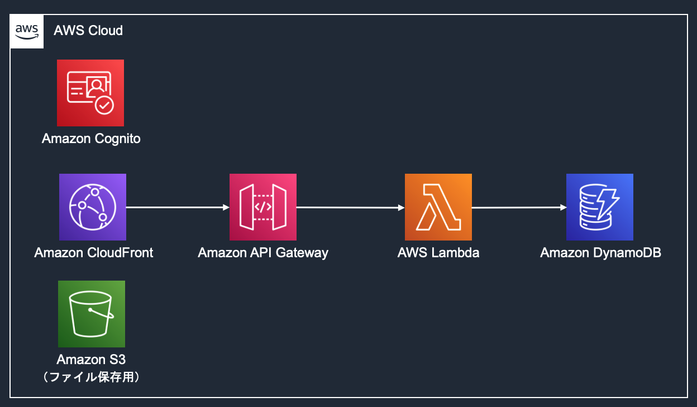

# web app デモ バックエンド

このディレクトリは1つのAWSアカウントにデプロイされるインフラのIaCを含みます。

- `/bin/backend.ts`において、`BackendStack`と命名されているスタック
- `BackendStack`は以下のAWSリソースを含みます。



## デプロイ手順

バッックエンドをデプロイする手順をまとめます。

### デプロイ実行環境の準備

デプロイを実行する端末には、下記のソフトウェアが必要です。

* AWS CLI
* Node.js 14以上

次に、必要な依存関係をインストールします。以下のコマンドを実行してください。

なお、以下全て、シェルコマンドの初期カレントディレクトリはこの `README.md` が配置されたディレクトリと仮定します。

```sh
# IaCの依存関係をインストール
npm ci

# CDKを ap-northeast-1 リージョンで使えるように初期化する
AWS_REGION=ap-northeast-1 npx cdk bootstrap
```

一連の操作は通常5分程度で完了します。完了したら、次の手順に進んでください。

### バックエンドリソースのデプロイ

1. バックエンドのリソースを新規にデプロイするためには、下記コマンドを実行します。

    ```sh
    npx cdk deploy BackendStack
    ```

    デプロイは通常5分程度で完了します。

    デプロイが完了すると、CLIにStack outputが表示されますので、メモしておいてください。

    ```text
    Outputs:
    BackendStack.ApiEndpoint4F160690 = https://xxxxxx.execute-api.ap-northeast-1.amazonaws.com/api/
    BackendStack.CognitoIdentityPoolId = ap-northeast-1:xxxxxxx-xxxx-xxxx-xxxxx-xxxxxxxx
    BackendStack.CognitoUserPoolId = ap-northeast-1_xxxxxxxxx
    BackendStack.CognitoUserPoolWebClientId = xxxxxxxxxxxxxxxxx
    BackendStack.FileAssetS3BuckentName = backendstack-xxxxxxxxxxxx
    ```

    注意

    `npx cdk deploy`コマンドで以下のエラーが出た場合の対処法について

    ```text
    $ npx cdk deploy BackendStack
    [+] Building 3.0s (4/4) FINISHED                                                                            
    => [internal] load build definition from Dockerfile                                                   0.0s
    => => transferring dockerfile: 37B                                                                    0.0s
    => [internal] load .dockerignore                                                                      0.0s
    => => transferring context: 2B                                                                        0.0s
    => ERROR [internal] load metadata for public.ecr.aws/sam/build-python3.9:latest                       2.9s
    => [auth] aws:: sam/build-python3.9:pull token for public.ecr.aws                                     0.0s
    ------
    > [internal] load metadata for public.ecr.aws/sam/build-python3.9:latest:
    ------
    failed to solve with frontend dockerfile.v0: failed to create LLB definition: unexpected status code [manifests latest]: 403 Forbidden
    ```

    以下のコマンドを実行し、ECRへログインをした後、再度`npx cdk --`のコマンドを実行してください。

    ```shell
    aws ecr-public get-login-password --region us-east-1 | docker login --username AWS --password-stdin public.ecr.aws
    ```

2. サンプルのためのCognito Userの作成
    - ユーザー名: `demo-user`、パスワード: `cam4PTF.wdg1znw8vnk`のユーザーを作成します。
    - ユーザーの作成をするために、以下のコマンドを実行します。`<user-pool-id>`の箇所は手順1のアウトプットのCognitoのユーザープールIDに置き換えてください。

        ```shell
        aws cognito-idp admin-create-user \
        --user-pool-id "<user-pool-id>" \
        --username "demo-user" \
        --user-attributes Name=email,Value="demo@example.com" Name=email_verified,Value=true \
        --message-action SUPPRESS
        ```

    - ユーザーのパスワードを設定します。

        ```shell
        aws cognito-idp admin-set-user-password \
        --user-pool-id "<user-pool-id>" \
        --username "demo-user" \
        --password 'cam4PTF.wdg1znw8vnk' \
        --permanent
        ```

これでバックエンドのデプロイができました。次に[フロントエンドのデプロイ](../../frontend/README.md)に進んでください。

## Clean up

デプロイされたAWSリソースが不要になった場合、下記のコマンドですべて削除することができます。

```sh
npx cdk destroy --force
```
