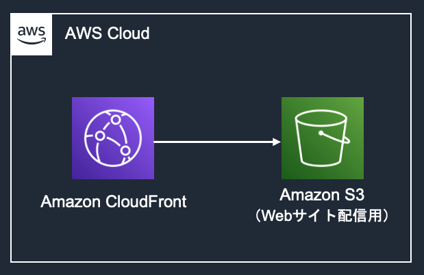

# web app デモ フロントエンド

このディレクトリは、web appデモのフロントエンド実装およびホスティングインフラのIaCを含みます。

インフラ構成は下図の通りで、通常のS3+CloudFrontの配信を行なっています。



## 使用している主な技術

* フロントエンド
  * React.js 18.0
  * MUI
  * react-dropzone
  * aws-amplify
* IaC
  * AWS CDK

## デプロイ方法

フロントエンドをAWSにデプロイする方法をまとめます。

なお、この手順の前にBackendStackをデプロイし、Cognito UserPoolやバックエンドAPIのリソースを用意する必要があります。
バックエンドのデプロイ方法は、[バックエンドのREADME.md](../backend/README.md) を参照してください。

### デプロイ実行環境の準備

デプロイを実行する端末には、下記のソフトウェアが必要です。バックエンドをデプロイした環境と同じものを流用することも可能です。

* AWS CLI
* Node.js 14以上

次に、必要な依存関係をインストールします。以下のコマンドを実行してください。

なお、以下全て、シェルコマンドの初期カレントディレクトリはこの `README.md` が配置されたディレクトリと仮定します。

```sh
# フロントエンドの依存関係をインストール
cd app
npm ci

# IaCの依存関係をインストール
cd ../infrastructure
npm ci
```

一連の操作は通常5分程度で完了します。完了したら、次の手順に進んでください。

### フロントエンド設定値の入力

[`app/src/config.ts`](./app/src/config.ts) を開き、必要な値を入力してください。

これらの値は `BackendStack` をデプロイした際のCDKのCLI出力や、[CloudFormationのマネジメントコンソール](https://console.aws.amazon.com/cloudformation/)から確認することができます。

### ビルド･デプロイ

フロントエンドをインターネットからアクセス可能にするため、最新のファイルをビルドして、S3にアップロードします。

今後フロントエンドのコードを変更して、AWS上にデプロイしたい場合も、同様にこの手順を実行してください。

これは以下のコマンドで実行できます:

```sh
# Reactのビルド
cd app
npm run build

# 初めてCDKをデプロイするリージョンの場合、CDKを ap-northeast-1 リージョンで使えるように初期化する
# バックエンドスタックのデプロイ時に実施済みの場合スキップ可能
AWS_REGION=ap-northeast-1 npx cdk bootstrap

# S3へのアップロードおよびCloudFrontのキャッシュInvalidate
cd ../infrastructure
npx cdk deploy
```

一連の操作は通常8分程度で完了します。完了したら、次の手順に進んでください。
デプロイすると、CDKのCLI出力にCloudFrontのURLが表示されます。

このURLを開いて、ログインページが表示されることを確認してください。
ログインページでは、[バックエンドのREADME.md](../backend/README.md)で作成したCognitoユーザーのユーザー名･パスワードを入力してください

ログイン後、サービスのページが閲覧できることを確認してください。

## Clean up

デプロイされたAWSリソースが不要になった場合、下記のコマンドですべて削除することができます。

```sh
cd infrastructure
npx cdk destroy --force
```
